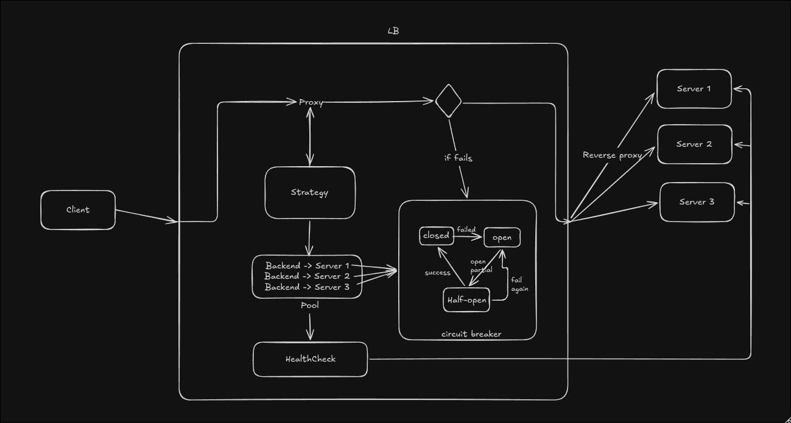

# loadbalancer

A layer-7 (HTTP) load balancer written in Go from scratch — a learning / resume project.
It reverse-proxies incoming HTTP requests across a pool of backend servers, with **pluggable
balancing algorithms**, **active + passive health checking**, **per-backend circuit breakers**,
and **YAML configuration** (nginx-style) so behavior changes without recompiling.

## Features

- **HTTP reverse proxy** — forwards client requests to backends via `httputil.ReverseProxy`
- **5 pluggable algorithms** behind a `Strategy` interface — selected by name in config:
  round robin, least connections, weighted round robin, IP hash, and consistent hashing
- **Active health checks** — a background goroutine pings each backend's `/health` and drops
  dead backends from rotation automatically (they rejoin on recovery)
- **Passive health via circuit breakers** — each backend has its own breaker
  (`closed → open → half-open`) that trips after repeated failures and self-probes for recovery
- **YAML config** — port, algorithm, backends + weights, health interval, and breaker
  thresholds are all set in `config.yaml` (no code changes to reconfigure)
- **Structured request logging** — `slog`-based middleware capturing method, path, status, latency

## Architecture



A request flows: **Client → LoggingMiddleware → Strategy → ReverseProxy → Server**.
The `Strategy` only ever picks from `Pool.Healthy()`, and a backend is healthy only when
**both** gates agree:

```
Healthy() = alive (set by HealthChecker)  AND  breaker.Allow() (per-backend CircuitBreaker)
```

Three independent flows coordinate through shared per-backend state, never calling each other directly:

- **Request flow** (on demand): pick a healthy backend → forward → stream the response back.
- **Health flow** (background timer): `HealthChecker` GETs `/health` on each server → sets `alive`.
- **Breaker flow** (on real outcomes): the proxy's `ModifyResponse`/`ErrorHandler` hooks call
  `RecordSuccess`/`RecordFailure`, tripping the circuit after N failures.

## Configuration

Everything is driven by [`config.yaml`](config.yaml) — the operator-facing interface, like `nginx.conf`:

```yaml
port: 8080
algorithm: round_robin   # round_robin | least_conn | weighted | ip_hash | consistent_hash

health:
  interval: 10s
  path: /health

circuit_breaker:
  threshold: 3
  cooldown: 10s

backends:
  - url: http://localhost:9001
    weight: 3
  - url: http://localhost:9002
    weight: 1
  - url: http://localhost:9003
    weight: 1
```

Change the algorithm, add a backend, or rebalance weights → edit the file, restart. **Same
binary, different behavior, no recompile.**

## Balancing algorithms

| Algorithm | Config name | How it picks | Best for |
|---|---|---|---|
| Round robin | `round_robin` | cycles through backends in order | even load, simplest |
| Least connections | `least_conn` | fewest in-flight requests | uneven request durations |
| Weighted round robin | `weighted` | proportional to per-backend weight | heterogeneous backends |
| IP hash | `ip_hash` | `hash(client IP) % n` — sticky | simple client affinity |
| Consistent hash | `consistent_hash` | hash ring + virtual nodes — sticky | affinity that survives backend changes |

## Project layout

```
config.yaml             # operator config: port, algorithm, backends+weights, health, breaker
scripts/test.sh         # e2e test harness — exercises every algorithm, prints distribution
cmd/
  lb/main.go            # entrypoint — loads config, builds strategy, starts the server
  backend/main.go       # test backend server (run several on different ports)
internal/
  loadbalancer.go       # LoadBalancer: http.Handler (pick → forward), Start()
  middleware.go         # LoggingMiddleware + statusRecorder (status + latency)
  health.go             # HealthChecker: background ticker pinging /health
  config/config.go      # YAML config structs + Load() + custom Duration type
  pool/
    pool.go             # ServerPool: Healthy(), Backends()
    backend.go          # Backend: URL, ReverseProxy (+ hooks), alive, conns, weight, breaker
    circuitbreaker.go   # CircuitBreaker: closed/open/half-open state machine
  algorithms/
    strategy.go         # Strategy interface (Next)
    roundrobin.go / leastconn.go / weighted.go / iphash.go / consistenthash.go
```

## Requirements

- Go 1.22+ (uses method-based `ServeMux` routing and `slog`)
- One dependency: [`github.com/goccy/go-yaml`](https://github.com/goccy/go-yaml)

## Running it

**1. Start the backend servers** (three terminals, or background them with `&`):

```bash
go run ./cmd/backend -port=9001
go run ./cmd/backend -port=9002
go run ./cmd/backend -port=9003
```

**2. Start the load balancer** (reads `config.yaml`):

```bash
go run ./cmd/lb
```

The load balancer listens on the port from `config.yaml` (default `:8080`).

## Testing

The included harness starts everything, exercises **every** algorithm (patching `config.yaml`
per run), and reports the per-backend distribution with a bar chart and stickiness checks:

```bash
./scripts/test.sh              # all algorithms
./scripts/test.sh weighted     # just one
```

It cleans up all processes and restores `config.yaml` on exit. Manual checks:

```bash
# round robin / weighted — sequential
for i in $(seq 1 6); do curl -s localhost:8080/; done

# least connections — concurrent, needs latency
for i in $(seq 1 6); do curl -s localhost:8080/slow & done; wait

# ip hash / consistent hash — sticky per client
for ip in 1.1.1.1 2.2.2.2 3.3.3.3; do curl -s -H "X-Forwarded-For: $ip" localhost:8080/; done
```

## What's implemented

- [x] Reverse proxy + server pool
- [x] `Strategy` interface + 5 algorithms (round robin, least-conn, weighted, IP hash, consistent hash)
- [x] Active health checks
- [x] Passive health via per-backend circuit breakers
- [x] Structured request logging middleware (`slog`)
- [x] YAML configuration (algorithm, backends, weights, health, breaker)
- [x] End-to-end test harness

## Future enhancements

The core load balancer is complete. These are natural extensions that could be added later:

- **Metrics + `/stats` endpoint** — per-backend request counts, errors, in-flight, circuit state as JSON
- **Graceful shutdown** — `signal.NotifyContext` + `http.Server.Shutdown` to finish in-flight requests
- **TLS termination** — accept HTTPS from clients, forward HTTP to backends
- **Retry on failure** — transparently retry a failed request on another backend
- **Custom `Rewrite` / `SetXForwarded`** — set `X-Forwarded-Host` / `-Proto`, control IP spoofing
- **Dynamic config reload** — re-read `config.yaml` without a restart
- **Unit tests** — strategy distribution, config parsing
```
